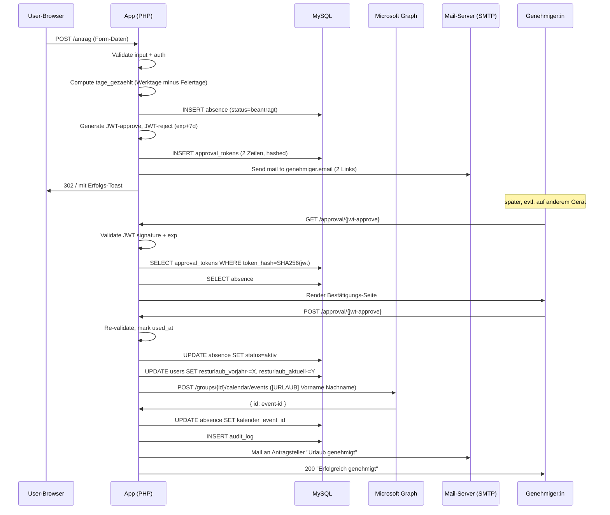
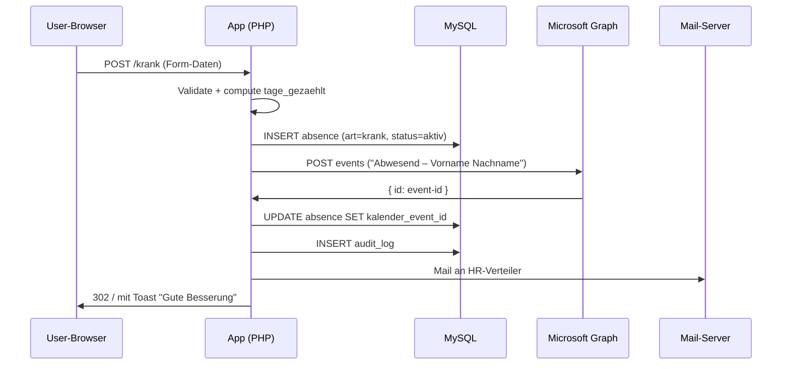
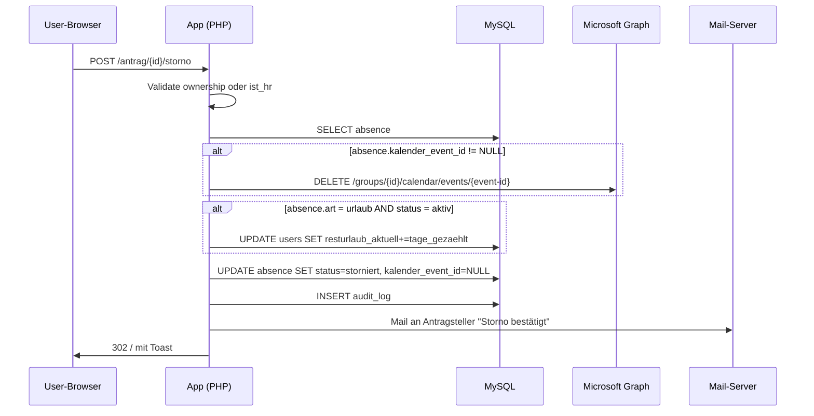

# Architektur — neo-afk

Sequenzdiagramme für die kritischen Flows. Mermaid-Syntax — rendert in GitHub und VS Code mit Mermaid-Plugin.

> **Hinweis:** Dieses Dokument entstand 2026-05 in der initialen Plan-Phase
> und enthält noch konkrete Werte aus dem ursprünglichen Deployment-Kontext
> (Domain, Mailboxen, Bundesland). Für die laufende, deployment-neutrale
> Architektur-Doku siehe [`docs/architecture/`](docs/architecture/).

## 1. Login (M365-SSO)

```mermaid
sequenceDiagram
  participant U as User-Browser
  participant A as App (PHP)
  participant E as Entra ID

  U->>A: GET /login
  A->>A: state = random; store in session
  A->>U: 302 https://login.microsoftonline.com/{tenant}/oauth2/v2.0/authorize?...
  U->>E: Login-Page
  E->>U: 302 /auth/callback?code=...&state=...
  U->>A: GET /auth/callback
  A->>A: Validate state matches session
  A->>E: POST /token (code + client_secret)
  E->>A: { access_token, id_token, refresh_token }
  A->>A: Decode id_token, extract oid/email/name
  A->>A: SELECT/INSERT users WHERE entra_oid=oid
  A->>A: Create session (user_id)
  A->>U: 302 /
```

## 2. Urlaubsantrag → Approval → Kalender



## 3. Krankmeldung (sofort wirksam)



## 4. Storno



## 5. Resturlaub-Abbuchungs-Logik

Bei Approval eines Urlaubs:

```
verfügbar_vorjahr = user.resturlaub_vorjahr
verfügbar_aktuell = user.resturlaub_aktuell

abbuchen_vorjahr = MIN(absence.tage_gezaehlt, verfügbar_vorjahr)
abbuchen_aktuell = absence.tage_gezaehlt - abbuchen_vorjahr

user.resturlaub_vorjahr -= abbuchen_vorjahr
user.resturlaub_aktuell -= abbuchen_aktuell
```

Bei Storno (Vereinfachung wie im Power-Platform-Vorgänger): zurückbuchen nur auf `resturlaub_aktuell`, nicht auf `vorjahr`.

## 6. Werktage-Berechnung

```php
function computeTageGezaehlt(
    DateTimeImmutable $start,
    DateTimeImmutable $end,
    string $halbtagStart, // 'ganztag' | 'nachmittag'
    string $halbtagEnde,  // 'ganztag' | 'vormittag'
    array $feiertage      // ['2026-01-01', ...]
): float {
    $tage = 0.0;
    $current = $start;
    while ($current <= $end) {
        $wd = (int)$current->format('N'); // 1=Mo..7=So
        $dateStr = $current->format('Y-m-d');
        if ($wd <= 5 && !in_array($dateStr, $feiertage, true)) {
            $tage += 1;
        }
        $current = $current->modify('+1 day');
    }
    if ($halbtagStart === 'nachmittag') $tage -= 0.5;
    if ($halbtagEnde === 'vormittag') $tage -= 0.5;
    return max(0, $tage);
}
```

## 7. Cron-Flows

### 7.1 Jahreswechsel (1.1. 02:00)
```
SELECT * FROM users WHERE ist_aktiv=1
FOREACH user:
  user.resturlaub_vorjahr = user.resturlaub_aktuell
  user.resturlaub_aktuell = user.jahresanspruch
  audit_log entry
```

### 7.2 Verfall (1.4. 02:00)
```
UPDATE users SET resturlaub_vorjahr = 0 WHERE ist_aktiv = 1
audit_log entries
```

### 7.3 Reminder (täglich, 09:00)
```
SELECT absences WHERE status='beantragt' AND created_at < NOW() - INTERVAL 2 DAY
FOREACH absence:
  Mail an genehmiger: "Erinnerung: Urlaubsantrag wartet auf Genehmigung"
```

### 7.4 Token-Cleanup (täglich, 02:00)
```
DELETE FROM approval_tokens WHERE expires_at < NOW() - INTERVAL 30 DAY
```
(30 Tage Aufbewahrung über Ablauf hinaus für Audit-Zwecke.)

## 8. Schichten-Modell (Code-Architektur)

```
HTTP Request
  ↓
Slim Router
  ↓
Middleware (Auth, CSRF, Logging)
  ↓
Controller (validate input, orchestrate)
  ↓
Service (Business-Logik: ApprovalService, ResturlaubService, GraphClient, MailService)
  ↓
Model (Data-Access via DBAL Query-Builder)
  ↓
DB / Microsoft Graph / SMTP
```

Strikt: Controller ruft Service ruft Model. Niemals Controller → DB direkt. Niemals Model → Service.

## 9. Was NICHT in Phase 1 ist (für spätere Iterationen)

- Multi-Tenant (immer nur ein Mandant pro Instanz)
- Mehrstufige Approvals (immer nur ein Genehmiger pro Antrag)
- Sonderurlaub-Kontingente (Umzug, Hochzeit, Trauerfall)
- Anteilige Resturlaubs-Berechnung bei unterjährigem Eintritt/Austritt
- In-App-Push-Notifications (nur Mail)
- Mobile-App (responsive Web reicht)
- Vertretungs-Workflow
